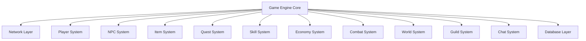

## Core System Architecture

```mermaid
flowchart TB
    A[Game Engine Core]

    A --> B[Network Layer]
    A --> C[Player System]
    A --> D[NPC System]
    A --> E[Item System]
    A --> F[Quest System]
    A --> G[Skill System]
    A --> H[Economy System]
    A --> I[Combat System]
    A --> J[World System]
    A --> K[Guild System]
    A --> L[Chat System]
    A --> M[Database Layer]
```

