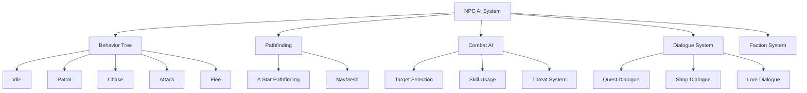

## NPC AI System

```mermaid
flowchart TB
    A[NPC AI System]

    A --> B[Behavior Tree]
    A --> C[Pathfinding]
    A --> D[Combat AI]
    A --> E[Dialogue System]
    A --> F[Faction System]

    B --> B1[Idle]
    B --> B2[Patrol]
    B --> B3[Chase]
    B --> B4[Attack]
    B --> B5[Flee]

    C --> C1[A Star Pathfinding]
    C --> C2[NavMesh]

    D --> D1[Target Selection]
    D --> D2[Skill Usage]
    D --> D3[Threat System]

    E --> E1[Quest Dialogue]
    E --> E2[Shop Dialogue]
    E --> E3[Lore Dialogue]
```
