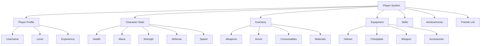

## Player System

```mermaid

flowchart TB
    A[Player System]

    A --> B[Player Profile]
    A --> C[Character Stats]
    A --> D[Inventory]
    A --> E[Equipment]
    A --> F[Skills]
    A --> G[Achievements]
    A --> H[Friends List]

    B --> B1[Username]
    B --> B2[Level]
    B --> B3[Experience]

    C --> C1[Health]
    C --> C2[Mana]
    C --> C3[Strength]
    C --> C4[Defense]
    C --> C5[Speed]

    D --> D1[Weapons]
    D --> D2[Armor]
    D --> D3[Consumables]
    D --> D4[Materials]

    E --> E1[Helmet]
    E --> E2[Chestplate]
    E --> E3[Weapon]
    E --> E4[Accessories]
```
