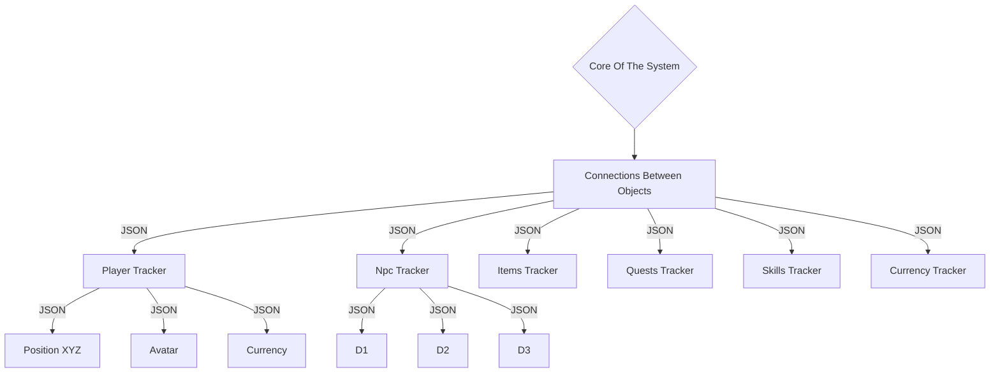

```mermaid

flowchart TB
  A{Core Of The System}

  B[Connections Between Objects]

  C[Player Tracker]
  C1[Position XYZ]
  C2[Avatar]
  C3[Currency]

  D[Npc Tracker]

  E[Items Tracker]

  F[Quests Tracker]

  G[Skills Tracker]

  H[Currency Tracker]

  A --> B
  B -- JSON --> C
  B -- JSON --> D
  B -- JSON --> E
  B -- JSON --> F
  B -- JSON --> G
  B -- JSON --> H

  C -- JSON --> C1
  C -- JSON --> C2
  C -- JSON --> C3

  D -- JSON --> D1
  D -- JSON --> D2
  D -- JSON --> D3
```
