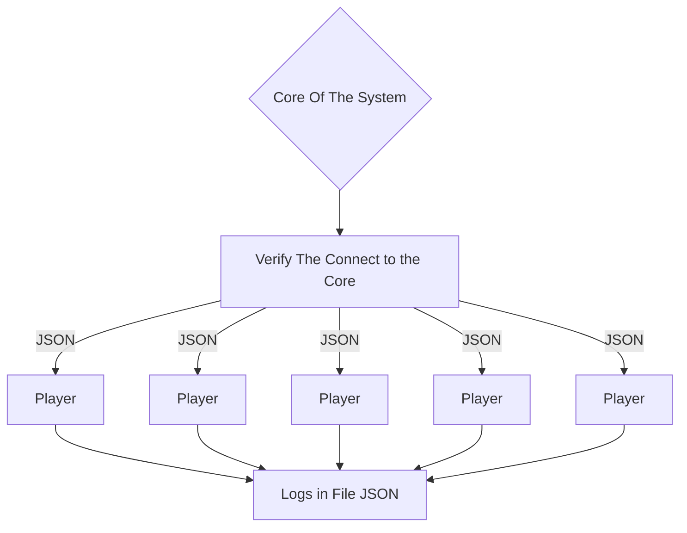

```mermaid

flowchart TB
  A{Core Of The System}
  AA[Logs in File JSON]
  B[Verify The Connect to the Core]
  C[Player]
  D[Player]
  E[Player]
  F[Player]
  G[Player]

  A --> B
  B -- JSON --> C
  B -- JSON --> D
  B -- JSON --> E
  B -- JSON --> F
  B -- JSON --> G


  C --> AA
  D --> AA
  E --> AA
  F --> AA
  G --> AA
```
