## Core System Architecture

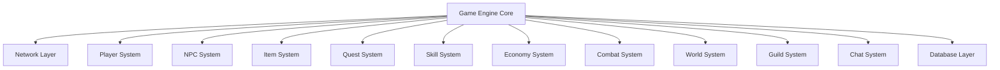

---

## Player System

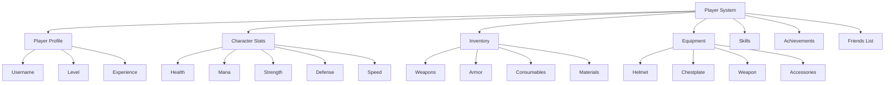

---

## NPC AI System

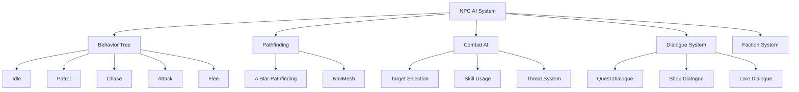

---

## Inventory & Item System

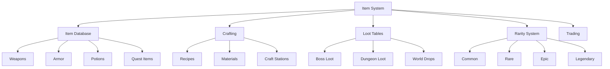

---

## Quest System

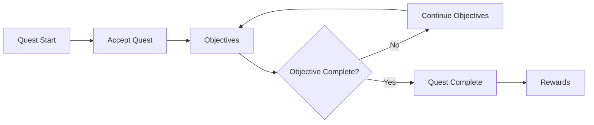

---

## Combat System

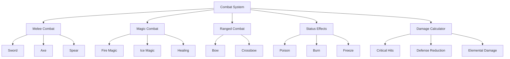

---

## Multiplayer Network System

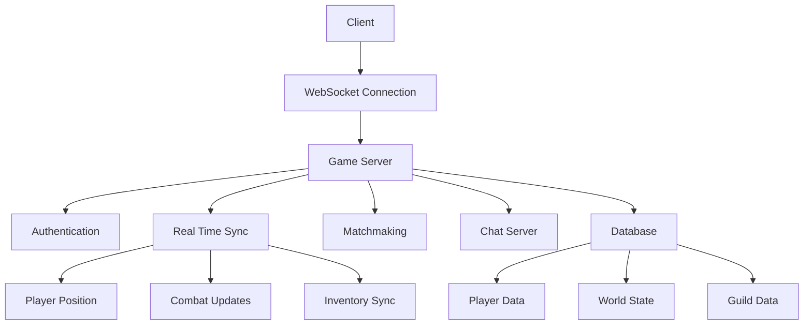

---

## Database Structure

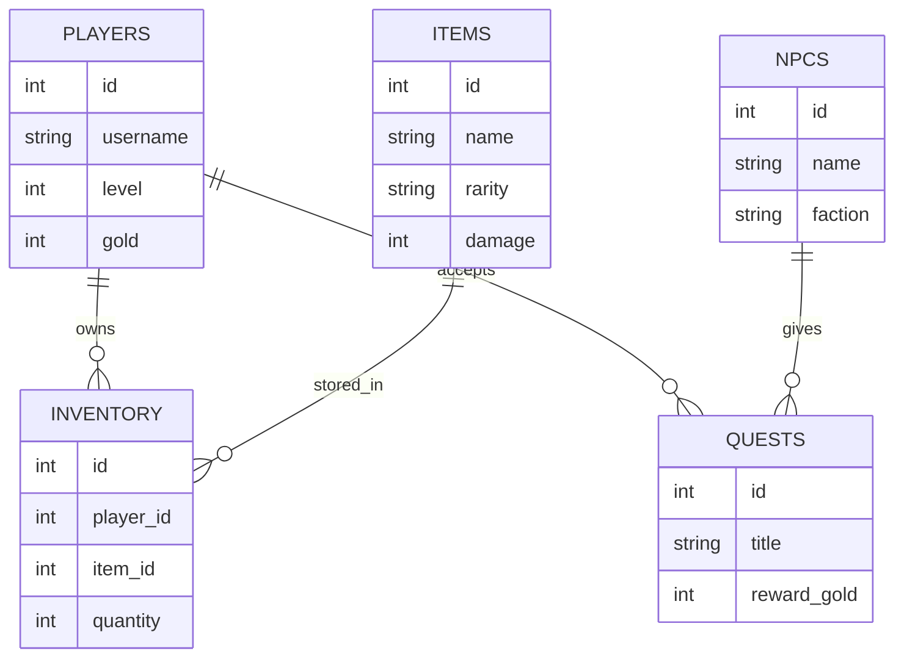

---

## Crafting System

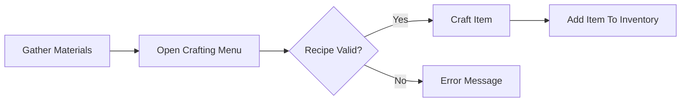

---

## Guild System

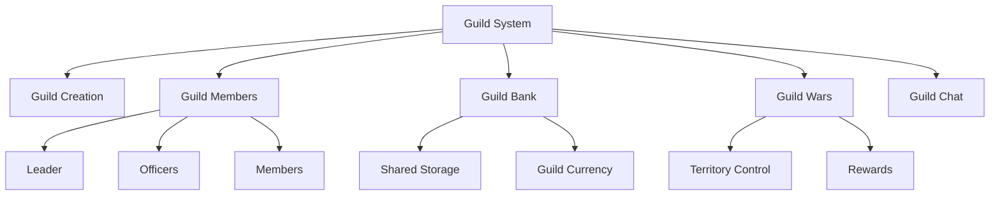

---

## World Generation System

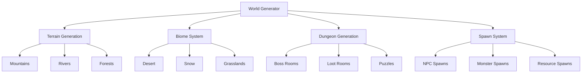

---

## Authentication System

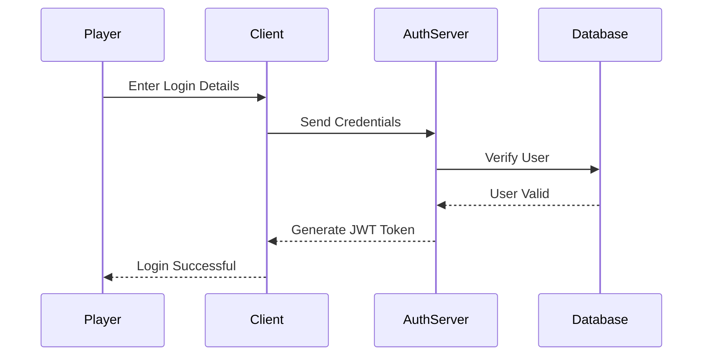

---

## Server Architecture

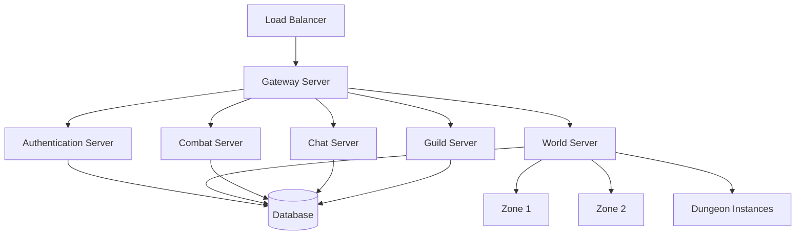

---

## Full Game Loop

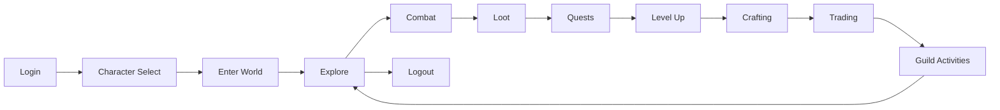

---

## ECS (Entity Component System)

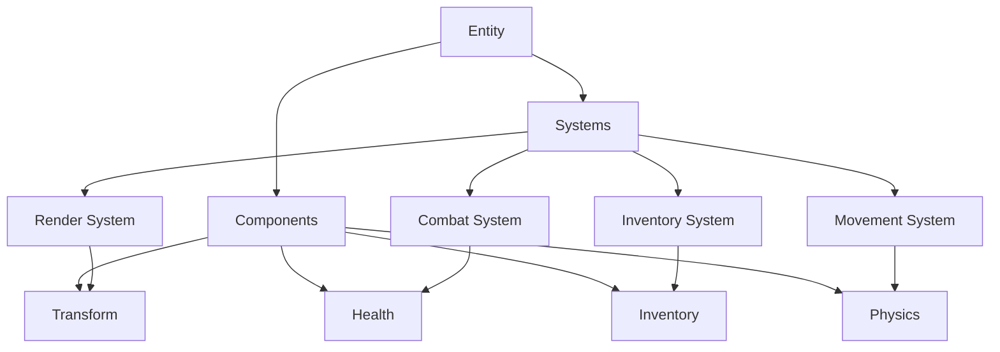

---

## Game Save Flow

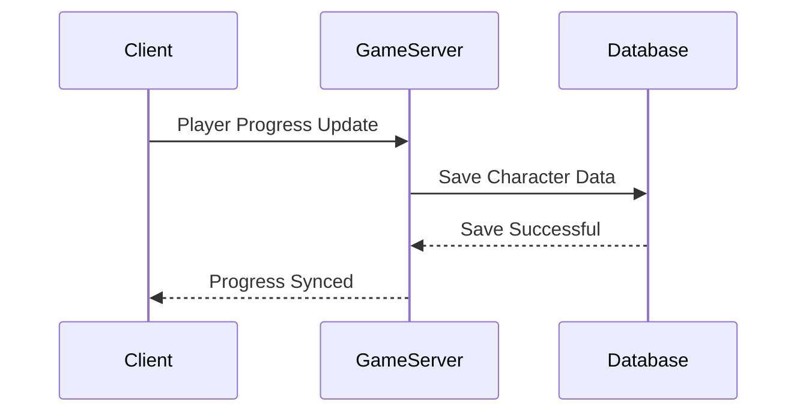
