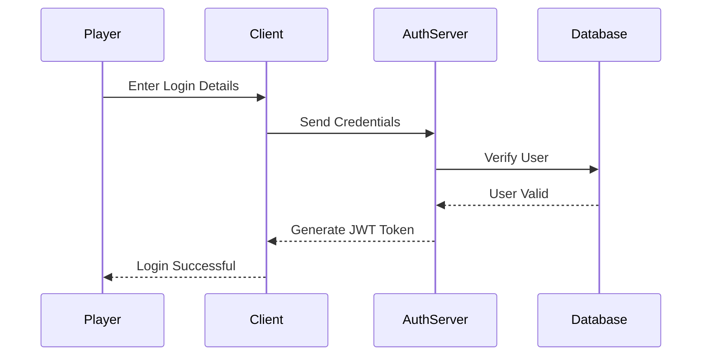

## Authentication System

```mermaid
sequenceDiagram
    participant Player
    participant Client
    participant AuthServer
    participant Database

    Player->>Client: Enter Login Details
    Client->>AuthServer: Send Credentials
    AuthServer->>Database: Verify User
    Database-->>AuthServer: User Valid
    AuthServer-->>Client: Generate JWT Token
    Client-->>Player: Login Successful
```
