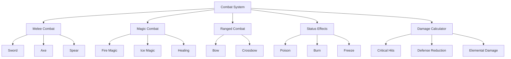

## Combat System

```mermaid
flowchart TB
    A[Combat System]

    A --> B[Melee Combat]
    A --> C[Magic Combat]
    A --> D[Ranged Combat]
    A --> E[Status Effects]
    A --> F[Damage Calculator]

    B --> B1[Sword]
    B --> B2[Axe]
    B --> B3[Spear]

    C --> C1[Fire Magic]
    C --> C2[Ice Magic]
    C --> C3[Healing]

    D --> D1[Bow]
    D --> D2[Crossbow]

    E --> E1[Poison]
    E --> E2[Burn]
    E --> E3[Freeze]

    F --> F1[Critical Hits]
    F --> F2[Defense Reduction]
    F --> F3[Elemental Damage]
```
