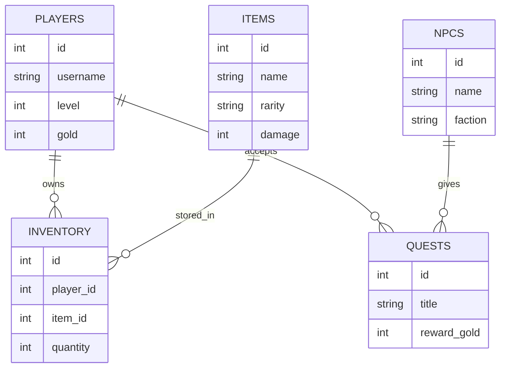

## Database Structure

```mermaid
erDiagram
    PLAYERS {
        int id
        string username
        int level
        int gold
    }

    INVENTORY {
        int id
        int player_id
        int item_id
        int quantity
    }

    ITEMS {
        int id
        string name
        string rarity
        int damage
    }

    QUESTS {
        int id
        string title
        int reward_gold
    }

    NPCS {
        int id
        string name
        string faction
    }

    PLAYERS ||--o{ INVENTORY : owns
    ITEMS ||--o{ INVENTORY : stored_in
    PLAYERS ||--o{ QUESTS : accepts
    NPCS ||--o{ QUESTS : gives
```
