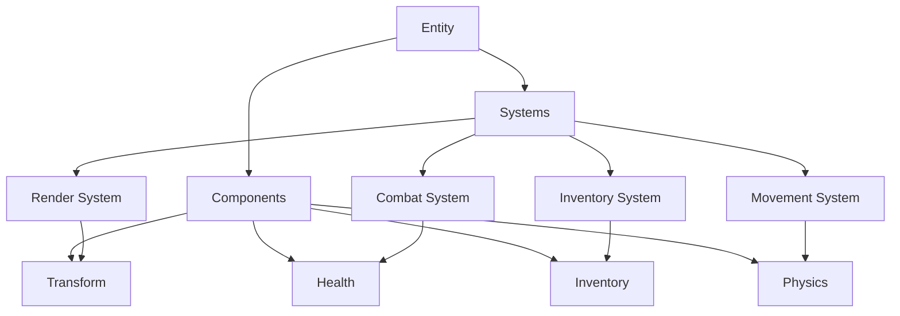

## ECS (Entity Component System)

```mermaid
flowchart TB
    A[Entity]

    A --> B[Components]
    A --> C[Systems]

    B --> B1[Transform]
    B --> B2[Health]
    B --> B3[Inventory]
    B --> B4[Physics]

    C --> C1[Render System]
    C --> C2[Combat System]
    C --> C3[Movement System]
    C --> C4[Inventory System]

    C1 --> B1
    C2 --> B2
    C3 --> B4
    C4 --> B3
```
