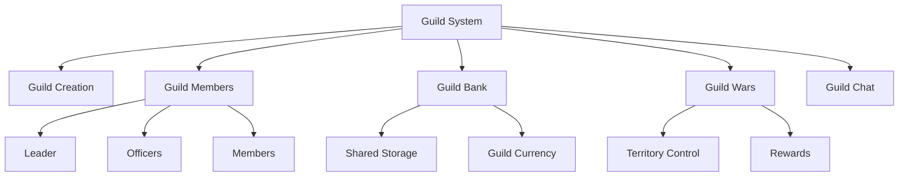

## Guild System

```mermaid
flowchart TB
    A[Guild System]

    A --> B[Guild Creation]
    A --> C[Guild Members]
    A --> D[Guild Bank]
    A --> E[Guild Wars]
    A --> F[Guild Chat]

    C --> C1[Leader]
    C --> C2[Officers]
    C --> C3[Members]

    D --> D1[Shared Storage]
    D --> D2[Guild Currency]

    E --> E1[Territory Control]
    E --> E2[Rewards]
```
