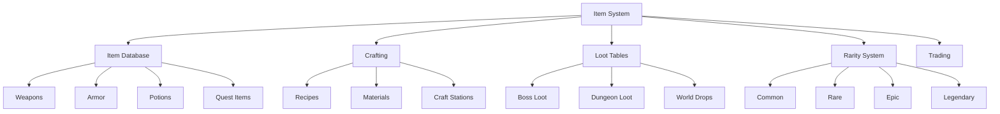

## Inventory & Item System

```mermaid
flowchart TB
    A[Item System]

    A --> B[Item Database]
    A --> C[Crafting]
    A --> D[Loot Tables]
    A --> E[Rarity System]
    A --> F[Trading]

    B --> B1[Weapons]
    B --> B2[Armor]
    B --> B3[Potions]
    B --> B4[Quest Items]

    C --> C1[Recipes]
    C --> C2[Materials]
    C --> C3[Craft Stations]

    D --> D1[Boss Loot]
    D --> D2[Dungeon Loot]
    D --> D3[World Drops]

    E --> E1[Common]
    E --> E2[Rare]
    E --> E3[Epic]
    E --> E4[Legendary]
```
