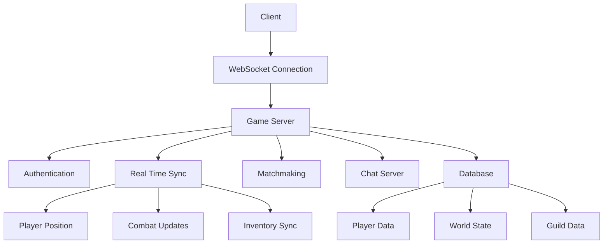

## Multiplayer Network System

```mermaid
flowchart TB
    A[Client]

    A --> B[WebSocket Connection]
    B --> C[Game Server]

    C --> D[Authentication]
    C --> E[Real Time Sync]
    C --> F[Matchmaking]
    C --> G[Chat Server]

    E --> E1[Player Position]
    E --> E2[Combat Updates]
    E --> E3[Inventory Sync]

    C --> H[Database]
    H --> H1[Player Data]
    H --> H2[World State]
    H --> H3[Guild Data]
```
