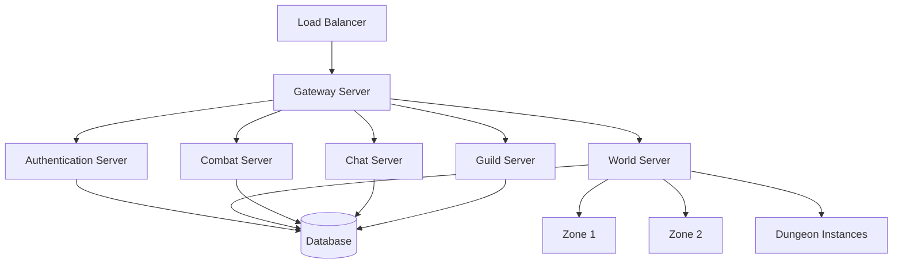

## Server Architecture

```mermaid
flowchart TB
    A[Load Balancer]

    A --> B[Gateway Server]

    B --> C[Authentication Server]
    B --> D[World Server]
    B --> E[Combat Server]
    B --> F[Chat Server]
    B --> G[Guild Server]

    D --> H[Zone 1]
    D --> I[Zone 2]
    D --> J[Dungeon Instances]

    C --> K[(Database)]
    D --> K
    E --> K
    F --> K
    G --> K
```
