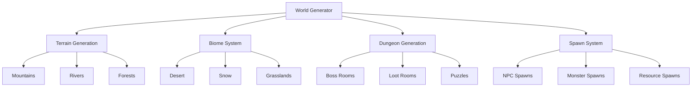

## World Generation System

```mermaid
flowchart TB
    A[World Generator]

    A --> B[Terrain Generation]
    A --> C[Biome System]
    A --> D[Dungeon Generation]
    A --> E[Spawn System]

    B --> B1[Mountains]
    B --> B2[Rivers]
    B --> B3[Forests]

    C --> C1[Desert]
    C --> C2[Snow]
    C --> C3[Grasslands]

    D --> D1[Boss Rooms]
    D --> D2[Loot Rooms]
    D --> D3[Puzzles]

    E --> E1[NPC Spawns]
    E --> E2[Monster Spawns]
    E --> E3[Resource Spawns]
```
